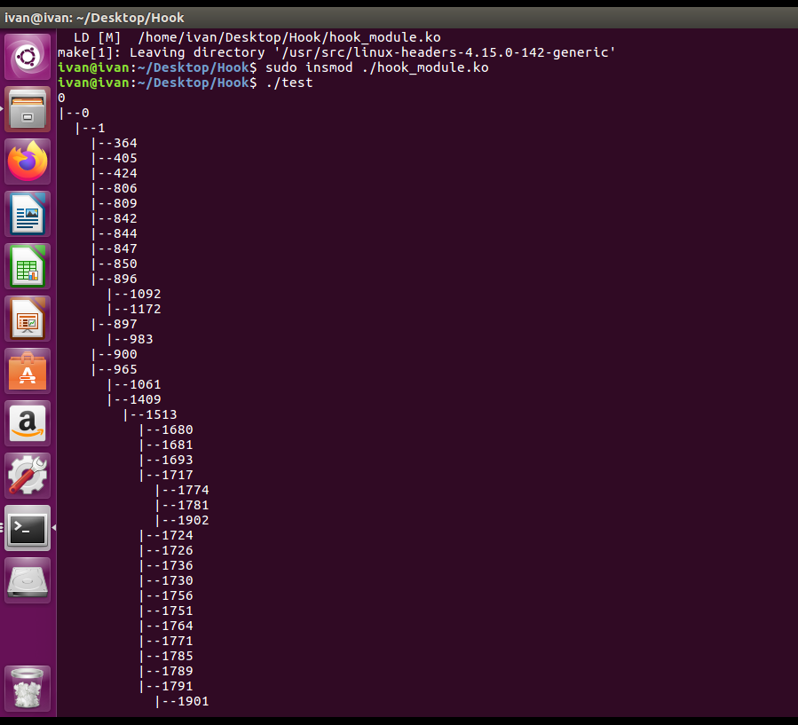

# 题目

1、在Linux内核中增加一个系统调用，并编写对应的linux应用程序。利用该系统调用能够遍历系统当前所有进程的任务描述符，并按进程父子关系将这些描述符所对应的进程id（PID）组织成树形结构显示

# 程序的主要设计思路、实现方式

大体上思路是写一个内核模块，该模块在加载时直接修改sys_call_table处的内存，在合适的位置处添加一个新的系统调用服务例程的入口地址。在卸载该模块时，重新还原修改前的数据。所以当想要使用该新增的系统功能调用，只需加载该模块并使用syscall函数显式传入系统调用号来调用我们自己写的系统调用，而不需要修改内核源码并重新编译内核。

本程序的实现方法类似hook拦截系统功能调用的思路，主要通过写一个内核模块来修改sys_call_table实现，不过这里并不是修改sys_call_table的某个入口地址的来拦截某个系统调用，而是在sys_call_table的那块内存中新增一个入口地址，sys_call_table[n]=new_addr; 这里n就是新增的系统功能调用号，new_addr就是我们自己写的内核函数地址。然后当我们的用户代码想要调用这个新增的n号系统功能调用时，可以使用syscall(n)函数来手动调用。

# 程序的模块划分

## sys_call_table地址的获取

这个sys_call_table的地址可以靠读取/proc/kallsyms来获取。

/proc/kallsyms是内核提供的一个动态符号表，他与System.map这种编译时产生的静态符号表不同，他是当前内核运行状态下的符号表数据，直接反映当前系统正在使用的各个符号的最正确的地址。System.map可能不准！

在/proc/kallsyms中查找sys_call_table这一符号的地址：


因为我们的系统是64位系统，对应的sys_call_table的内存地址是第一行的0xffffffff92000280，此外，中间的那个R表示该符号所在的节区（section）是只读的。所以我们后续修改此处的内存数据时，需要获取写权限。

然后我们需要一个可用的系统功能调用号，这个通过/usr/include/asm-generic/unistd.h 文件中的内容来知道：


可见285号往后是可以给我们新增使用的，这里我选择的号码是300。

 

## 写权限的获取：

这一步参考了网络上的资料，发现总体又两种办法。

1.第一种是通过内联汇编代码修改cr0寄存器的第16位来实现，第16位控制wp（write protect）写保护，置0以后可以允许超级用户程序向只读内存执行写操作。这种办法有局限性，比如arm等架构的cpu没有cr0寄存器，也就无法通过cr0来关闭写保护。

2.第二种办法是通过获取要修改的虚拟地址对应的物理页表项pte,(可以用lookup_address来获取)，pte中存储了该地址所在的物理页的页信息：


第1位就是读写信息，我们只要把这一位置1即可。我的实现中就是使用了第二种办法来获取写入权限。代码大致如下：

```c
/* make the page writable */
int make_rw(unsigned long address){
	unsigned int level;
	pte_t *pte = lookup_address(address, &level);//查找虚拟地址address所对应的物理页表项
	pte->pte |= _PAGE_RW;//设置页表读写属性
	return 0; 
}
/* make the page write protected */
int make_ro(unsigned long address){
	unsigned int level;
	pte_t *pte = lookup_address(address, &level);
	pte->pte &= ~_PAGE_RW;//设置只读属性
	return 0;
}
 
```


## 内核模块的编写

有了上面的前置铺垫，下面就可以编写内核代码了：

 ```c++
#define my_syscall_num 300     //新增的300号系统功能调用
#define sys_call_table_address 0xffffffff92000280   //sys_call_table的地址

int make_rw(unsigned long address);//取消写保护
int make_ro(unsigned long address); //写保护

unsigned long * sys_call_table; //指向sys_call_table首地址
unsigned long saved; //保存原始数据

//自定义的300号系统调用
asmlinkage long sys_mycall(struct process_tree __user * buf)
{
    //这里需要完成具体的任务要求
	return 0;
}

// 内核模块入口函数
static int __init syscall_init_module(void){
	sys_call_table = (unsigned long *)sys_call_table_address;
	saved =  sys_call_table[my_syscall_num];//保存该位置的原始数据
    make_rw((unsigned long)&sys_call_table[my_syscall_num]);//获取写权限           
	sys_call_table[my_syscall_num] = (unsigned long)&sys_mycall;//写入入口地址
    make_ro((unsigned long)&sys_call_table[my_syscall_num]); //恢复为只读                                     
	return 0;
}

//内核模块出口函数，恢复sys_call_table
static void __exit syscall_cleanup_module(void){
    make_rw((unsigned long)&sys_call_table[my_syscall_num]);//获取写权限           
	sys_call_table[my_syscall_num] = saved;//恢复原始数据
    make_ro((unsigned long)&sys_call_table[my_syscall_num]); //恢复为只读   
}

//导出该模块
module_init(syscall_init_module);
module_exit(syscall_cleanup_module);
MODULE_LICENSE("GPL");
MODULE_DESCRIPTION("Hook Module");  

 ```


## 系统功能调用的实现

该系统调用能够遍历系统当前所有进程的任务描述符，并按进程父子关系将这些描述符所对应的进程id（PID）组织成树形结构显示。

实现思路：

利用init_task（0号进程），从init进程的任务描述符init_task开始，深度优先，先序递归遍历每个进程的子进程的任务描述符，并将结果存在内核态的全局结构,进程树process_tree中，遍历结束后将进程树的数据拷贝到用户态传入进来的指针指向的内存地址供用户态代码读取）

进程树的数据结构定义大致如下

```C
#define MAX_PROCESS_AMOUNT 1024

//进程节点
struct process_tree_node{
	int pid;   
	int depth; 
};
//进程树结构
struct process_tree{
    struct process_tree_node processes[MAX_PROCESS_AMOUNT];
    int cnt;//数中节点个数
};
```

其中每个节点存储进程的id和这一进程的深度depth用于后续的打印显示操作。

由于我们的遍历是深度先序进行的，所以process_tree的节点数组也是按照深度先序顺序填充的。这样用户态的代码直接顺序读取processes数组并按照depth信息打印即可

系统功能调用的代码实现如下：

```C
//自定义的300号系统调用
void process_traverse_helper(struct task_struct *p,int depth){
	struct list_head *list;
	struct task_struct *task;
    tree.processes[tree.cnt].pid= p->pid;
    tree.processes[tree.cnt++].depth= depth;
	list_for_each(list, &(p->children)){
    	task = list_entry(list, struct task_struct, sibling);
		process_traverse_helper(task, depth+1);
	}

}
asmlinkage long sys_mycall(struct process_tree __user * buf)
{
    printk(KERN_ALERT "my_system_call\n");
    int depth = 0;
	struct task_struct *p = &init_task;
    tree.cnt=0;//清空计数器
	process_traverse_helper(p, depth);//从0号进程开始深度遍历
	// 将内核数据拷贝到用户态
	if(copy_to_user((struct process_tree *)buf, &tree, sizeof(struct process_tree ))){
		return -1;
	}
	return 0;
}
```

## 测试程序的编写

写一个简单的测试程序，通过syscall(300)来使用我们自己写的系统调用，以树形结构打印出所有进程的pid

```C

#define MAX_PROCESS_AMOUNT 1024
//进程节点
struct process_tree_node{
	int pid;   
	int depth; 
};
//进程树结构
struct process_tree{
    struct process_tree_node processes[MAX_PROCESS_AMOUNT];
    int cnt;
};

struct process_tree tree; //进程树

int main(void){
	int ret_code=syscall(300, &tree); //300号系统功能调用
    printf("%d\n",ret_code);
	for(int i = 0; i < tree.cnt; i++){
		for(int j = 0; j < tree.processes[i].depth; j++){
			printf("  ");
		}
		printf("|--%d\n", tree.processes[i].pid);                            	
	}
	return 0;
}

```


# 所遇到的问题及解决的方法

一开始不清楚如何遍历进程描述符，后来通过查看内核源码以及结合网络资料学习到了linux内核的通用链表的使用方法来遍历子进程描述符。

# 使用说明

```shell
sudo make hook_module   //生成内核模块
sudo make test			//生成测试程序
sudo insmod hook_module.ko  //安装内核模块
./test				//运行测试程序
sudo rmmod hook_module  //卸载内核模块
```


# 程序运行截图

测试环境：ubuntu 16.04

内核版本:  4.15.0-142-generic

